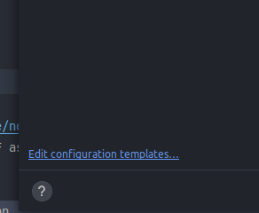
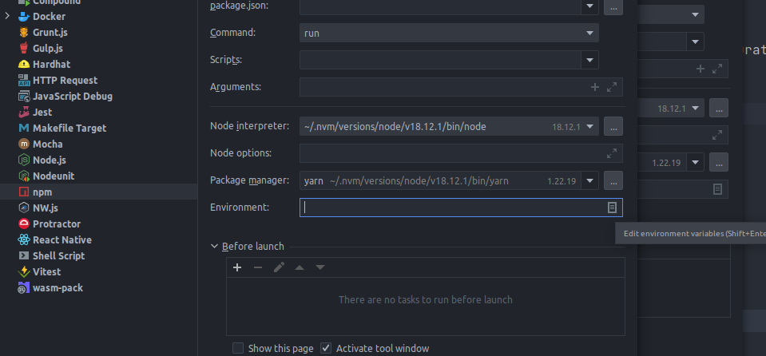
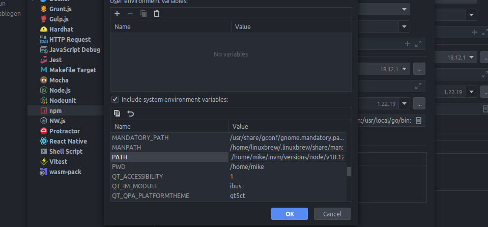
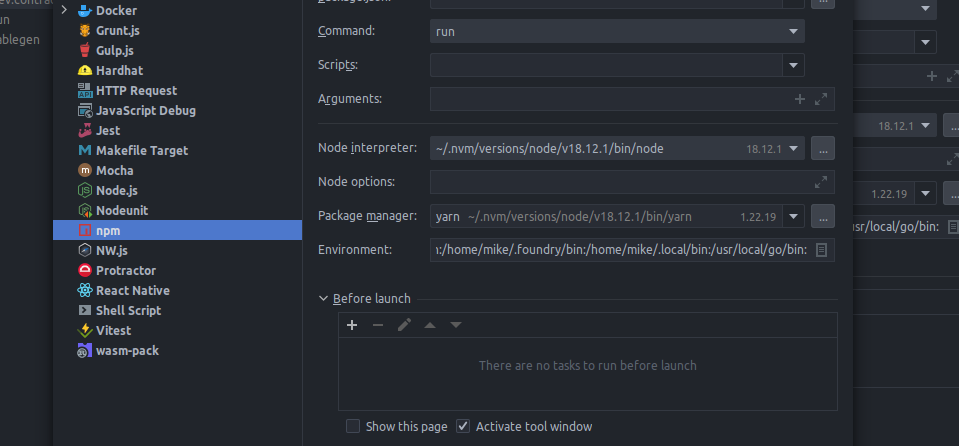

# imaigine

## Repo
- The fantasy-map-generator has been added as a git subtree using the command `git subtree add --prefix packages/fantasy-map-generator  https://github.com/Azgaar/Fantasy-Map-Generator.git master --squash`.
- More info: https://blog.developer.atlassian.com/the-power-of-git-subtree/?_ga=2-71978451-1385799339-1568044055-1068396449-1567112770
- To update the map from upstream: ```git subtree pull --prefix packages/fantasy-map-generator https://github.com/Azgaar/Fantasy-Map-Generator.git master --squash```

## Setup
- NodeJs : This project needs **Node 18** :  
```shell 
nvm use 18
```

- Install dependencies for all projects: 
```shell 
pnpm i --recursive
```

- Default .env for contracts
```shell 
cp packages/contracts/.env.example packages/contracts/.env 
```


## Running
- Local evm node: 
```shell 
pnpm dev:contracts
```
- Webapp: 
```shell 
pnpm dev:client
```
- Server: 
```shell 
pnpm dev:server
```

## Possible errors and how to resolve
- `Error: Command failed with ENOENT: forge cleans`

or you know, just click on the run button next to the script in the package.json to let webstorm handle it

if you get  or any similar error when trying to run contract
scripts using webstorm the fix for this is copying your terminal $PATH and overriding the webstorm run configuration.
best to update the template so you won't have to do it everytime





Open terminal and run `$PATH` then copy it (minus bash and the error at the end)


Override this variable


Should now affect all npm configurations in the project


# Issues Encountered
There seems to be a problem with the newest version of anvil. The following is the fix:
````shell
foundryup -C f3c20d5
````
